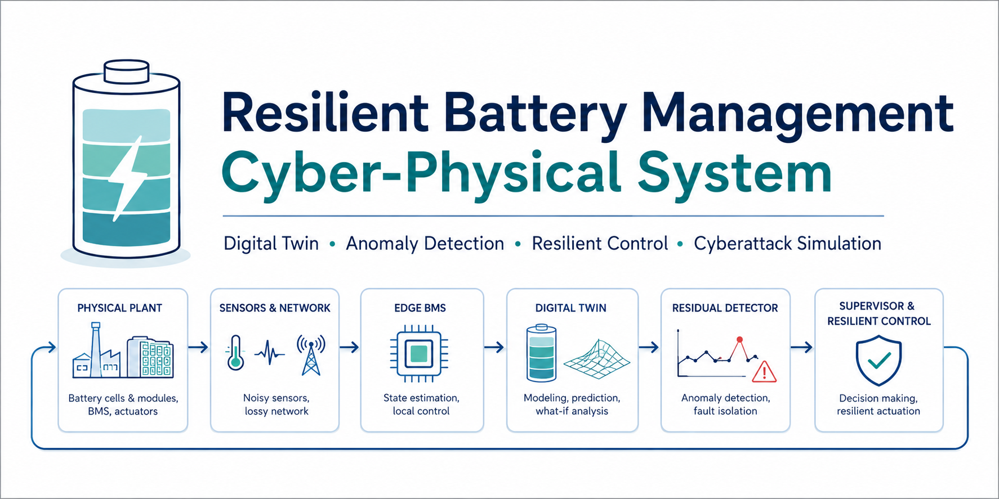
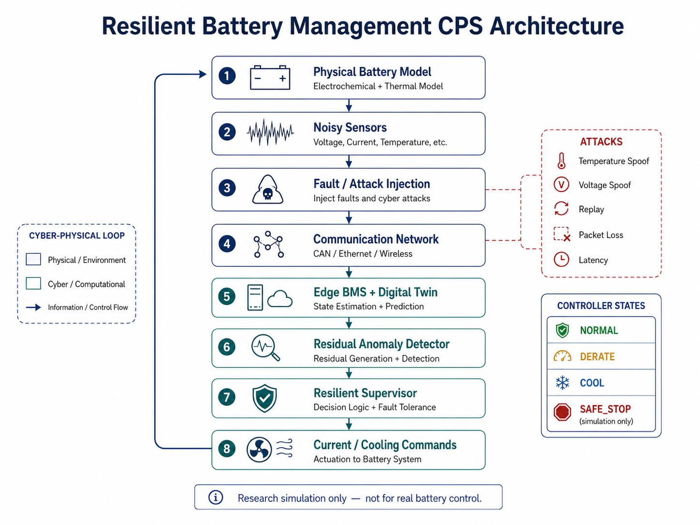
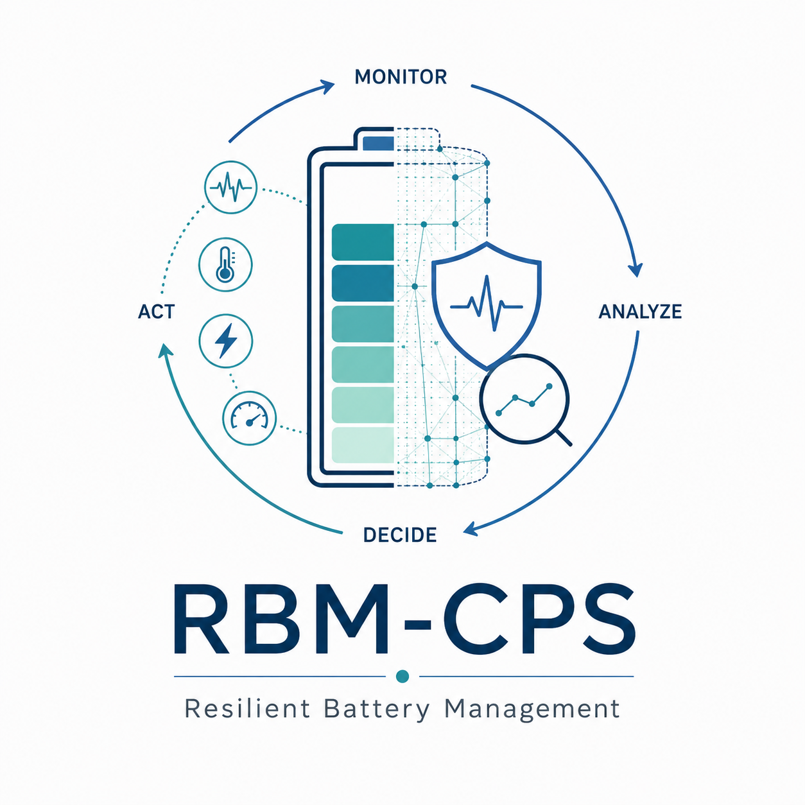

<p align="center">
  
</p>

# Resilient Battery Management Cyber-Physical System

[](https://github.com/Hirakhyzer/resilient-battery-management-cps/actions/workflows/ci.yml)


A reproducible **cyber-physical systems (CPS)** research platform for studying resilient battery management with a reduced-order battery plant, noisy sensing, lossy/latent communications, a physics-based digital twin, residual anomaly detection, cyber/fault injection, and fault-aware supervisory control.

> **Safety and research-status notice:** this repository is a software simulation scaffold. Its parameters and controller thresholds are illustrative. It must not be used to configure a real battery charger, protection circuit, vehicle BMS, or thermal-safety system.

## Core research question

**Can a battery-management CPS remain observable and behave safely when sensor measurements are noisy, delayed, lost, faulty, or maliciously manipulated?**

## CPS architecture

<p align="center">
  
</p>

The closed-loop platform connects the physical battery plant to noisy sensing, fault/attack injection, networked communication, an edge BMS and digital twin, residual-based anomaly detection, and resilient supervisory control.

```text
Physical battery model
        ↓
  noisy sensors
        ↓
 fault / attack injection
        ↓
 communication network
        ↓
 edge BMS + digital twin
        ↓
 residual anomaly detector
        ↓
 resilient supervisor
        ↓
 current / cooling commands
        └──────────────→ physical plant
```

## What is implemented

- first-order SOC + electrical polarization + thermal battery plant;
- voltage, temperature, and SOC measurements with noise;
- packet loss and communication latency;
- temperature/voltage bias and replay fault injection;
- physics-based digital twin;
- transparent multi-signal residual anomaly detector;
- supervisory states: `NORMAL`, `DERATE`, `COOL`, `SAFE_STOP` (simulation only);
- end-to-end closed-loop simulation;
- scenario runner and plots;
- unit tests and GitHub Actions CI;
- CPS architecture, threat model, and research roadmap.

## Repository structure

```text
resilient-battery-management-cps/
├── assets/                 # Project banner, architecture, cover
├── configs/
├── data/
├── docs/
├── results/
├── scripts/
├── src/bmscps/
├── tests/
├── .github/workflows/
├── pyproject.toml
└── README.md
```

## Quick start

```bash
git clone https://github.com/Hirakhyzer/resilient-battery-management-cps.git
cd resilient-battery-management-cps
python -m venv .venv
source .venv/bin/activate   # Windows: .venv\Scripts\activate
pip install -e '.[dev]'
pytest
```

Run the baseline cyberattack/resilience demo:

```bash
python scripts/run_demo.py --config configs/baseline.json --out results/demo
```

Compare scenarios:

```bash
python scripts/run_scenarios.py
```

## Digital-twin residual principle

For each measured variable, the defender compares the cyber measurement with the physics-based prediction:

\[
r_k = y_k - \hat{y}_k
\]

The current baseline uses normalized residual thresholds and persistence so a single noisy sample does not immediately trigger an anomaly. This is intentionally interpretable and provides a baseline for later Kalman filters, change-point detection, or physics-informed machine learning.

## Included research scenarios

| Scenario | Purpose |
|---|---|
| Normal operation | establish false-alarm baseline |
| Temperature spoof | test thermal-measurement integrity |
| Voltage spoof | test electrical residual detection |
| Replay | test stale but plausible telemetry |
| Lossy network | study resilience to missing measurements |
| Added latency | study cyber delay versus closed-loop response |

## Next research extensions

1. equivalent-circuit parameter estimation and uncertainty;
2. EKF/UKF SOC estimation;
3. richer electro-thermal plant or PyBaMM co-simulation;
4. physics-informed anomaly classifier;
5. combined physical fault + cyberattack experiments;
6. adaptive/event-triggered telemetry;
7. hardware-in-the-loop using a safe battery emulator or recorded traces.

See [`docs/ARCHITECTURE.md`](docs/ARCHITECTURE.md), [`docs/THREAT_MODEL.md`](docs/THREAT_MODEL.md), and [`docs/RESEARCH_ROADMAP.md`](docs/RESEARCH_ROADMAP.md).

## Project identity

<p align="center">
  
</p>

## Scientific integrity

Simulation outputs are synthetic and must not be described as experimental battery measurements. For publication, report parameter provenance, calibration data, uncertainty, detector thresholds, attack/fault definitions, random seeds, and held-out evaluation conditions.
